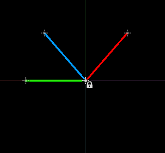

# Vector bench

This project allows to play with some of the `Vector2` operations that can be
used for learning purposes.

---

## List of supported operations

* Bounce
* Project
* Reflect
* Slide
* Snapped
* Tangent

---

## Example



The red line is an original vector, the green line is a vector parameter and the blue line is a result of:

```gdscript
var vec_result = vec.bounce(vec_param)
```
---
## Notice

The project is intended to work directly in the editor without running the scene.